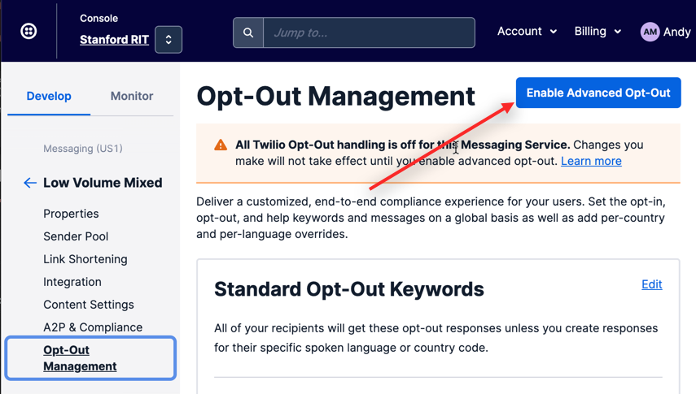
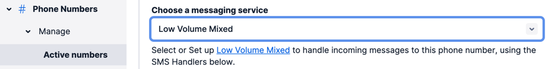

# Twilio Enhancements

We hope to add additional features to this module in the future, hence the generic name.  But, for starters we have:

- Support of opt-out using Twilio Messaging Service

## Opt-Out Integration with Twilio

Twilio's Message Service offers a Opt-Out Management.  This optional step allows Twilio to automatically block outgoing messages to users who elect to 'opt-out' by replying with 'STOP' or 'UNSUBSCRIBE' to a text.  Use of this feature is highly recommended as REDCap doesn't natively support opt-out and, depending on your users, could result spamming research participant and creating ill-will toward your institution.

Normally, if a participant opts-out of messages, the study team does not know.  Using this module, you can change this by capturing the opt-out changes and recording them to a text field in the project.  This allows you to, for example, prevent sending emails as well if someone opts-out.  Or, perhaps, reach out to the participant via email if they choose to opt-out of SMS correspondence.

### Instructions

#### In your REDCap Project:
1. Enable Twilio the way you normally do
2. Enable the EM on your project
3. Set the following parameters in the module configuration
   - Opt-out Field (and event) - if a participant opts-out, the timestamp of this change will be recorded in the field.  The field should be free-text or text as a datetime field - date only is not supported.  If a participant opts-back in, this field will be cleared.
   - Phone Field (and event) - this is the field in the project that corresponds to the phone number for the participant.  If the number is not unique in the project and a participant unsubscribes, all records with this field will be updated as unsubscribed.
   - Notification Email - this optional parameter will send an email each time a participant changes their opt-in/out status.

#### In your Twilio Account:
1. Create a Messaging Service (if it doesn't already exist) and enable Advanced Opt-Out:
    
2. Create your number (if it doesn't already exist) and make sure it is associated with the Messaging Service as a 'sender'.  You can do this from the Messaging Service or from the Number.  The image below shows how to assign a number to a Messaging Service from the Number interface:
    
3. As an aside, you should also ensure your Messaging Service is part of a campaign for A2P10DLC compliance.

Now, when someone responds with a 'STOP' message, your REDCap project will receive this change and update the opt-out field to the timestamp of the stop.  You could then, for example, have a check on an ASI for a future email survey that prevents the email from going out.

Note: You should be able to apply this to an existing Twilio number used by REDCap with no ill-effect.  It does NOT change the sid or token and does not affect normal REDCap behavior.
