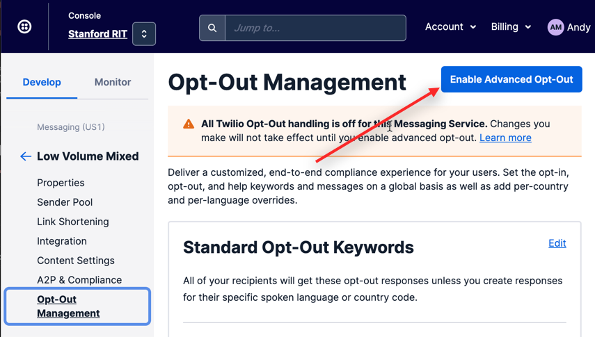
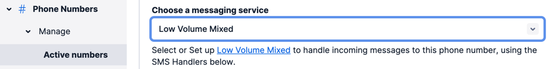

# Twilio Enhancements

We hope to add additional features to this module in the near future, hence the generic name.  But, for starters we have:

- Support of opt-out using Twilio Messaging Service when Advanced Opt-Out is Enabled

## Opt-Out Integration with Twilio

Twilio's Message Service offers Opt-Out Management.  This optional step allows Twilio to automatically block outgoing messages to users who elect to 'opt-out' by replying with 'STOP' or 'UNSUBSCRIBE' (or any other key words you specify in the Twilio setup) to the Twilio number via a text message.  Use of this feature is highly recommended as REDCap doesn't natively support opt-out management. In most cases, depending on your users and IRB, participants should **not** be contacted after opting out.

Without this module, when a participant opts-out of messages, the study team does not know and Twilio is no longer providing the 10 digit long code of numbers who have opted-out from their website.  By using this module, the study team can be informed of the opt-out status by capturing the opt-out changes (opt-out and opt-in). The timestamp of these changes will be recorded in the REDCap project in a text field.  Using logic in ASIs or Alerts and Notifications to check the opt-out field timestamp can also prevent emails from being sent when a participant opts-out.

### Instructions

#### In your REDCap Project:
1. Enable Twilio the way you normally do
2. Enable the EM on your project
3. Set the following parameters in the module configuration
   - Opt-out Field (and event) - if a participant opts-out, the timestamp of this change will be recorded in the field.  The field should be free-text or text as a datetime field - date only is not supported.  If a participant opts-back in, this field will be cleared.
   - Opt-out Checkbox (and event) - if a participant opts-out, and the study would like a checkbox to be checked, select the checkbox field here. This field is optional and if a checkbox field is not needed, it does not need to be selected.  NOTE: It is assumed the coded value of the checkbox to be set is 1. So if the checkbox field is [opt_out], the value of 1 will be stored in opt_out___1.
   - Phone Field (and event) - this is the field in the project that corresponds to the phone number for the participant.  If the number is not unique in the project and a participant unsubscribes, all records with this field will be updated as unsubscribed.
   - Notification Email - this optional parameter will send an email each time a participant changes their opt-in/out status.

#### In your Twilio Account:
1. Create a Messaging Service (if it doesn't already exist) and enable Advanced Opt-Out:
    
** NOTE: Once Advanced Opt-Out Management is enabled, contacting Twilio support to disable it. **

2. Create your number (if it doesn't already exist) and make sure it is associated with the Messaging Service as a 'sender'.  You can do this from the Messaging Service or from the Number.  The image below shows how to assign a number to a Messaging Service from the Number interface:
    

3. As an aside, you should also ensure your Messaging Service is part of a campaign for A2P10DLC compliance.

Now, when someone responds with a 'STOP' message, your REDCap project will receive this change and update the opt-out field to the timestamp of the stop.  You could then, for example, have a check on an ASI for a future email survey that prevents the email from going out.

Note: You should be able to apply this to an existing Twilio number used by REDCap with no ill-effect.  It does NOT change the sid or token and does not affect normal REDCap behavior.

### Future Plans
- [ ] Automate parts of the Twilio sub-account creation process based on the Twilio survey
- [ ] Add API calls to Twilio to retrieve billing and usage information from Twilio sub-accounts
